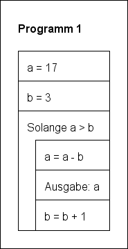
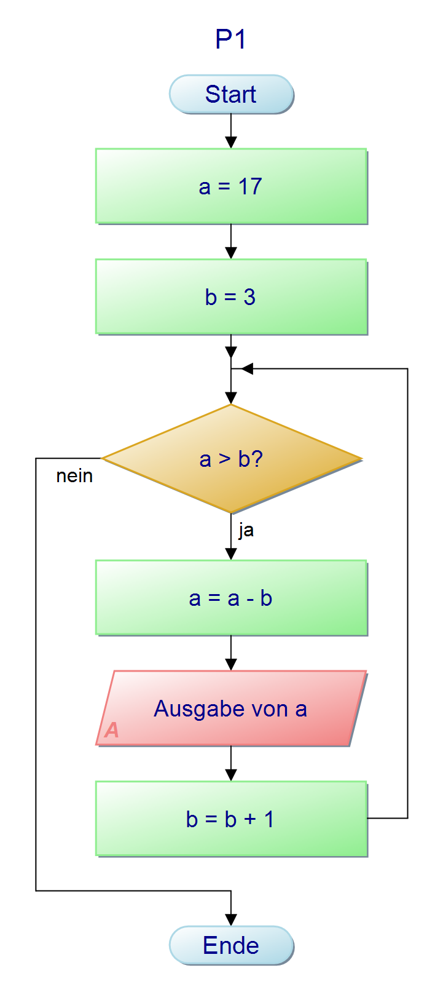
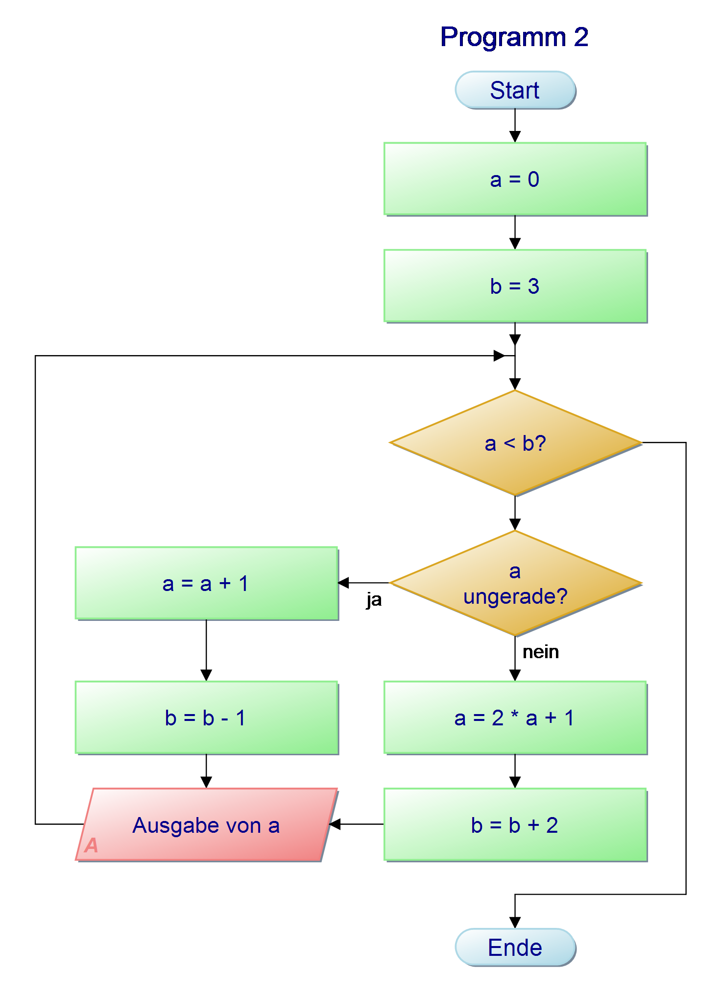
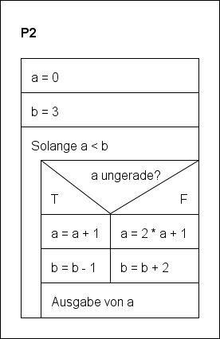
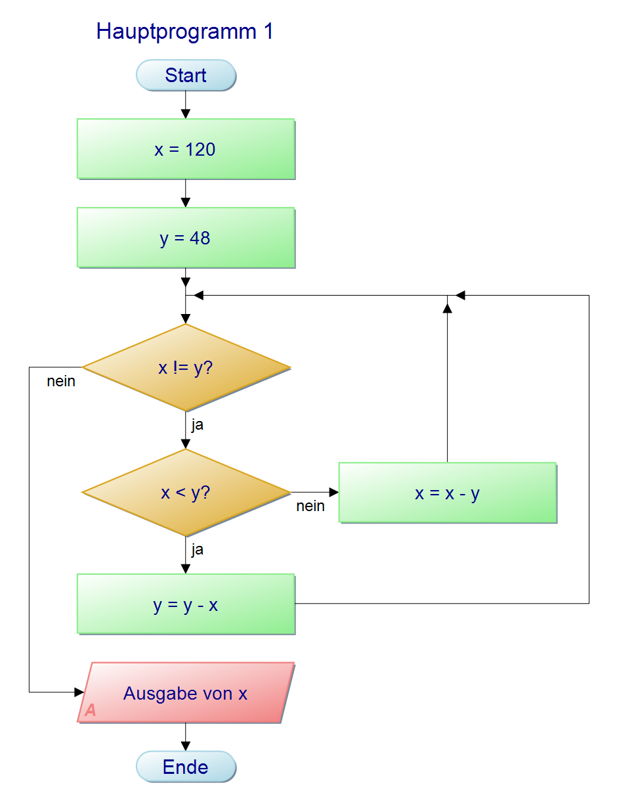
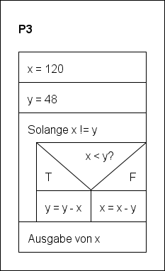

# Hausaufgabe 4

**Abgabe bis Montag, 16. September 2019 um 22:00h**

## Aufgabe 1

Gegeben ist das folgende Struktogramm:



- Geben Sie an, welche Zahlen dieses Programm ausgeben würde: 
  **Ausgabe: 14, 10, 5**
- Erstellen Sie ein Programmablaufplan mit dem [PAPDesigner](https://www.heise.de/download/product/papdesigner-51889)
- Exportieren Sie das Bild und speichern sie dieses unter dem Namen `p1_pap.png`
- Laden Sie diese Datei in dieses Github Repo (Oben rechts: * Upload files*)
- Binden Sie diese Datei hier ein durch den Befehl ``. Dafür müssen Sie diese Markdowndatei editieren (Stift oben rechts)



- Übersetzen Sie das Struktogramm in Python-Code. Schreiben Sie die Lösung in die Datei `p1.py`, die sie entweder hier neu erstellen oder mit einem Editor z.B. CS50 Sandbox bzw. CS50 IDE erstellen und dann entsprechend hochladen.

```java
a = 17
b = 3

while a > b:
    a = a - b
    print(a)
    b = b + 1
```

## Aufgabe 2

Gegeben ist der folgende Programmablaufplan:



- Geben sie an, welche Zahlen dieses Programm ausgeben würde: 
  **Ausgabe: 1, 3, 7**
- Erstellen Sie ein Struktogramm mit dem [Structorizer](https://structorizer.fisch.lu)
- Exportieren Sie das Bild und speichern sie dieses unter dem Namen `p2_struct.png`.
- Laden Sie diese Datei in dieses Github Repo.
- Binden Sie diese Datei hier ein durch den Befehl ``. Dafür müssen Sie diese Markdowndatei editieren (Stift oben rechts)



- Übersetzen Sie den Programmanlaufplan in Python-Code. Schreiben Sie die Lösung in die Datei `p2.py`, die sie entweder hier neu erstellen oder mit einem Editor z.B. CS50 Sandbox bzw. CS50 IDE erstellen und dann entsprechend hochladen.

```python
a = 0
b = 3

while a < b:
    if a % 2 == 0:
        a = a + 1
        b = b - 1
    else:
        a = 2 * a + 1
        b = b + 2
    print(a)
```

## Aufgabe 3

Gegeben ist der folgende Python-Quellcode (vgl. `p3.py`):

```python
x = 120
y = 48

while x != y:
    if x > y:
        x = x - y
    else:
        y = y - x
print(x)
```

Die Symbolik `x != y` prüft ob `x` und `y`ungleich sind.

- Was für eine Zahl gibt der Code aus?
  **Ausgabe: 24**
- Erstellen Sie einen Programmablaufplan und binden sie diesen als `p3_pap.png` ein.


- Erstellen Sie ein Struktogramm und binden sie dieses als `p3_struct.png` entsprechend ein.

